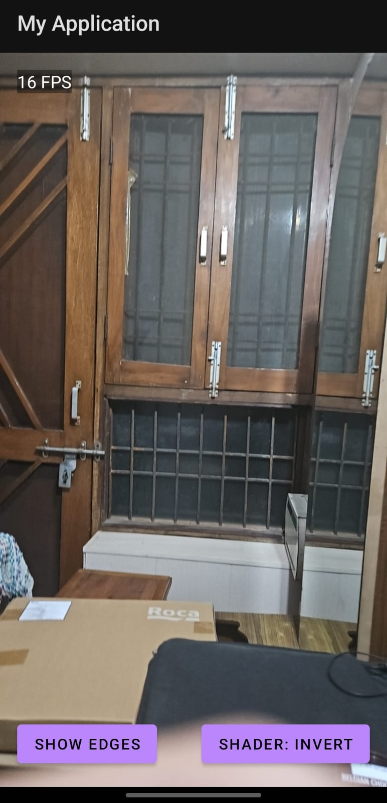
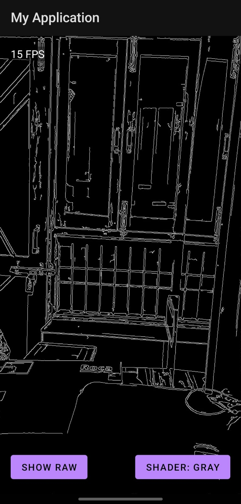
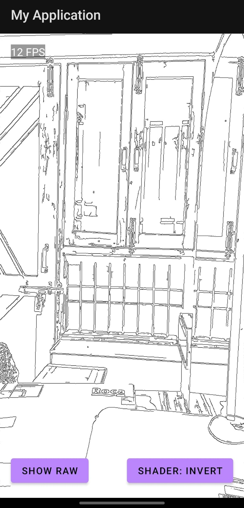

# Real-Time Edge Detection Android App

## Features Implemented

- Real-time camera feed using Camera2 API
- Native C++ image processing using OpenCV via JNI
- Button to toggle between:
    - Raw camera feed
    - Edge-detected output
- FPS counter to display live frame rate
- OpenGL rendering with shaders:
    - None
    - Grayscale
    - Inverted
- Frame flow managed using TextureView and GLSurfaceView
- OpenCV pipeline includes Canny and Gaussian Blur
- Aspect-ratio-safe camera resolution for balanced performance
- Rotation handling for consistent upright display

## Screenshots
| Raw Camera Feed | Edge Detection (Normal) | Edge Detection (Inverted) |
|-----------------|--------------------------|----------------------------|
|  |  |  |

## Setup Instructions

1. **NDK and CMake**
    - Install NDK from Android Studio: `SDK Manager > SDK Tools > NDK (Side by side)`
    - Ensure CMake is also installed and synced with your project

2. **OpenCV Integration**
    - Use OpenCV Android SDK (tested with OpenCV 4.5.5)
    - Copy required `.so` files (e.g., `libopencv_java4.so`) into `app/src/main/jniLibs/<arch>/`
    - Include OpenCV `include/` headers in `cpp/include/`
    - Link OpenCV libraries in `CMakeLists.txt`

3. **Permissions**
    - Add the following to `AndroidManifest.xml`:
      ```xml
      <uses-permission android:name="android.permission.CAMERA"/>
      ```

4. **Build and Run**
    - Run on a real Android device (Camera and OpenGL required)
    - App launches into live camera view with UI controls

## Architecture Overview

### Frame Flow

- `CameraController` captures frames using Camera2 API in YUV_420_888 format
- Only the Y-plane is used for edge detection (for speed)
- Frames are passed to native C++ using `processFrame()` through JNI
- OpenCV in C++ applies Gaussian blur followed by Canny edge detection
- The processed result is converted to BGR byte array and sent back
- `GLRenderer` uses OpenGL shaders to apply effects and render the final image

### Shaders and Effects

- Shaders are used for:
    - No effect 
    - Grayscale
    - Invert colors
- Fragment shaders are switched in real-time via UI buttons

## Additional Notes

- FPS is capped around 15–16 for balanced performance
- Shader switching and rendering are handled efficiently using OpenGL
- App is optimized for clarity and modular design
